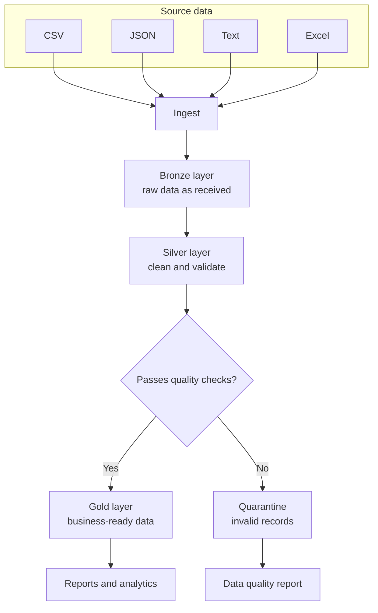

# Pipeline Architecture Diagram

```mermaid
flowchart TB
    subgraph Sources["Source data"]
        direction LR
        CSV["CSV"]
        JSON["JSON"]
        Text["Text"]
        Excel["Excel"]
    end

    CSV --> Ingest
    JSON --> Ingest
    Text --> Ingest
    Excel --> Ingest

    Ingest --> Bronze["Bronze layer<br/>raw data as received"]
    Bronze --> Silver["Silver layer<br/>clean and validate"]
    Silver --> Check{"Passes quality checks?"}

    Check -->|Yes| Gold["Gold layer<br/>business-ready data"]
    Check -->|No| Quarantine["Quarantine<br/>invalid records"]
    Quarantine --> Report["Data quality report"]

    Gold --> Consumers["Reports and analytics"]
```
